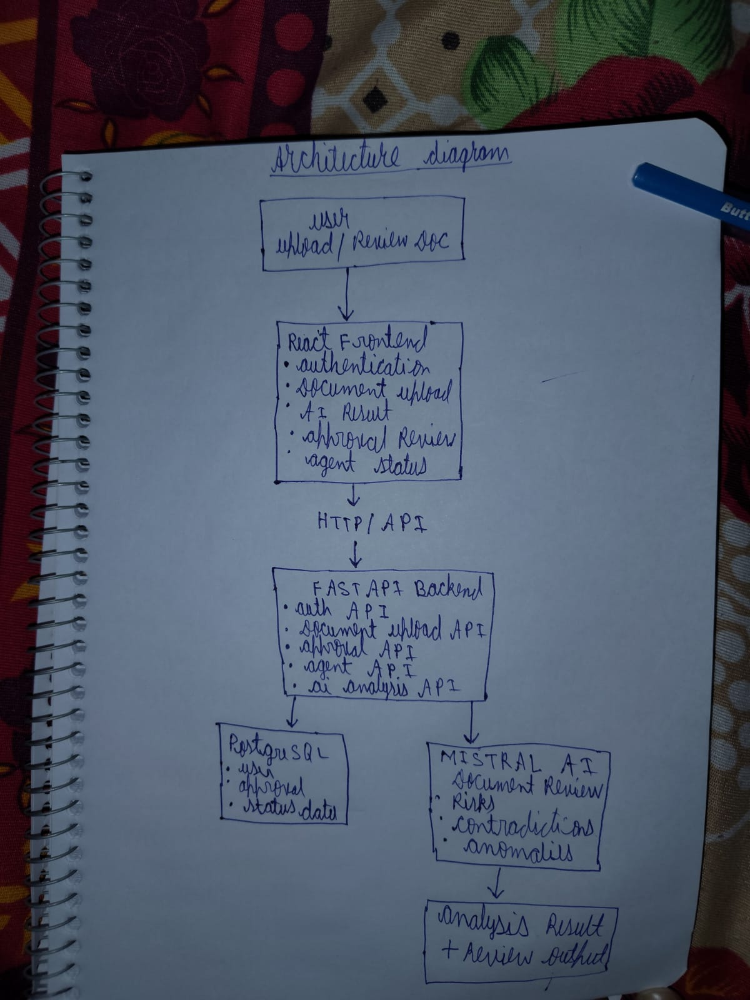

# Task 4 – Architecture Documentation

## Project Architecture

This project is an AI-powered document review and approval system built using a React frontend, FastAPI backend, PostgreSQL database, and Mistral AI.

The system allows users to upload documents and submit them for AI-powered review. The frontend communicates with the backend through HTTP APIs. The FastAPI backend handles authentication, document upload, approval management, and AI analysis.

The backend stores user and approval-related information in PostgreSQL. When a document is uploaded, it is processed through the backend and sent to the AI analysis service when required.

Mistral AI analyzes the document and helps identify:

- Document review results
- Potential risks
- Contradictions
- Anomalies
- Other important issues

The analysis results are returned to the backend and displayed to the user through the frontend.

## Architecture Diagram

The following diagram represents the overall architecture and data flow of the AI Document Assistant:

## Architecture Flow

1. The user interacts with the React frontend.
2. The frontend handles authentication and document upload.
3. Requests are sent to the FastAPI backend using HTTP APIs.
4. The backend manages authentication, document uploads, approval operations, and AI analysis.
5. User and approval data are stored in PostgreSQL.
6. Documents are sent to Mistral AI for analysis when required.
7. Mistral AI identifies risks, contradictions, anomalies, and document-related issues.
8. The analysis results and approval status are returned to the user through the frontend.

## Main Technologies

- Frontend: React
- Backend: FastAPI
- Database: PostgreSQL
- AI Service: Mistral AI
- Communication: HTTP/REST API
- Authentication: JWT